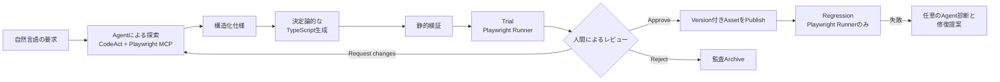

# E2ETestMAF

[English](README.md)

E2ETestMAFは、自然言語のテスト要求をレビュー可能でバージョン管理されたPlaywrightテストへ変換し、承認済みテストをLLMをブラウザ実行経路に含めずに実行する基盤です。

> **開発状況: Experimental (0.1.0)。** 最初の安定版までAPIや保存形式が変更される可能性があります。

## E2ETestMAFが解決すること

AI Agentは未知のWebアプリケーションを探索するのに適していますが、定期実行のたびにAgentがブラウザを操作する方式は、再現性とレビュー可能性に課題があります。一方、すべてのPlaywrightテストを手作業で作成・保守する方式には大きなコストがかかります。

E2ETestMAFは役割を次のように分離します。

- AgentとPlaywright MCPはアプリケーション探索と失敗診断を担当する。
- 決定論的Generatorが`@playwright/test`用のTypeScriptを生成する。
- 承認前に標準Playwright Runnerで生成コードそのものを試行する。
- 人間が仕様、コード、試行証跡をシナリオ単位で承認する。
- CIはAgent、LLM、MCP、モデル認証情報なしで承認済みコードを実行する。

## 主な機能

- 自然言語の目的から構造化テスト仕様とPlaywright TypeScriptを生成
- 対象リポジトリのFormatter、Linter、TypeScript、Playwright discoveryによる検証
- Trial時のJSON、JUnit、HTML、Screenshot、Trace、Console、Network証跡収集
- 仕様とコードのSHA-256に基づくシナリオ承認
- `e2e/generated`、`e2e/specs`、`e2e/metadata`に限定したPublish
- Agent認証を必要としないACTIVEシナリオの回帰実行
- 期待結果を変更しない失敗分類と限定修復
- 修復Branch、Commit、Push、Pull Request作成。自動Mergeは行わない

## Quick Start

### 前提条件

- Python 3.13
- [uv](https://docs.astral.sh/uv/)
- Node.js 22とnpm（CIでの基準Version）
- ChromeまたはChromium
- `package.json`、ローカルのPrettier、TypeScript、`@playwright/test`、およびlint ScriptまたはローカルESLintを持つ対象リポジトリ
- Authoring用の対応Agent Provider。Regressionには不要

このリポジトリからE2ETestMAFをセットアップします。

```bash
git clone https://github.com/jimineko/E2ETestMAF.git
cd E2ETestMAF
uv sync --group dev
npm ci
npx playwright install chrome chromium
```

Agent Providerを設定します。次はGemini Developer APIの最小例です。

```bash
export MAF_E2E_MODEL_PROVIDER=gemini
export MAF_E2E_MODEL_AUTH=api_key
export MAF_E2E_GEMINI_API_KEY=YOUR_API_KEY
export MAF_E2E_GEMINI_MODEL=gemini-2.5-flash-lite
```

対象アプリケーションリポジトリへDraftを生成し、Trialを実行します。

```bash
uv run maf-e2e author \
  --target-repo /path/to/web-app \
  --target-url http://localhost:3000 \
  --objective "未認証ユーザーがログイン画面を開ける" \
  --expected-result "ログイン見出し、メールアドレス欄、パスワード欄が表示される"
```

生成物は`/path/to/web-app/.maf-e2e/drafts/<scenario-id>/`へ保存されます。仕様、コード、Trial証跡を確認して承認・Publishします。

```bash
uv run maf-e2e review \
  --target-repo /path/to/web-app \
  --scenario-id <scenario-id>

uv run maf-e2e approve \
  --target-repo /path/to/web-app \
  --scenario-id <scenario-id> \
  --reviewer you@example.com

uv run maf-e2e publish \
  --target-repo /path/to/web-app \
  --scenario-id <scenario-id>
```

全ACTIVEシナリオを実行します。このコマンドはAgent設定を読み込まず、モデル認証情報を必要としません。

```bash
uv run maf-e2e regression \
  --target-repo /path/to/web-app \
  --environment staging
```

## 動作の仕組み



承認境界は明確です。Trialを通過したTypeScriptをHash化し、人間がレビューした同一コードだけをPublishします。探索や診断中の直接ブラウザ操作だけで回帰テストを承認することはできません。

## CLI概要

| 段階 | コマンド | 目的 |
|---|---|---|
| 作成 | `author` | アプリ探索、Asset生成、検証、Trial実行 |
| レビュー | `review` | 仕様、生成コード、Metadata、Trial結果を表示 |
| レビュー | `approve` | 仕様とコードのHashを承認 |
| レビュー | `request-changes` | シナリオを再作成へ戻す |
| レビュー | `reject` | Draftを除去し`.maf-e2e/rejected`へ監査記録を保存 |
| 公開 | `publish` | 承認済みシナリオを対象リポジトリの`e2e/**`へ保存 |
| 実行 | `regression` | AgentなしでACTIVEシナリオを実行 |
| 保守 | `analyze-failure` | 保存済み証跡から失敗を分類し、必要ならAgentで再調査 |
| 保守 | `repair` | 限定的なコード修復を検証し、必要ならGitHub PRを作成 |

オプション、使用例、終了コードは[CLIリファレンス](docs/cli.md)を参照してください。

## 生成されるAsset

Draftは承認されるまで正式なテストスイートから分離されます。

```text
.maf-e2e/
  drafts/<scenario-id>/        仕様、生成コード、Metadata、Trial証跡
  rejected/                    RejectされたDraftの監査記録
  regression/<run-id>/         Regression ReportとPlaywright Artifact

e2e/
  generated/<feature>/         承認済みPlaywright TypeScript
  specs/<feature>/             Version付き構造化仕様
  metadata/<feature>/          ACTIVE AssetのMetadataとHash
```

Publish時に仕様とコードのHashを再計算し、承認後に変更されていれば失敗します。

## Safety Guarantees

- `regression`はACTIVE Metadataだけを読み、固定されたPlaywright TypeScriptを実行する。
- 対象環境は`local`、`development`、`staging`に限定し、`production`を受け付けない。
- Publish先を対象リポジトリの`e2e`配下に限定する。
- 探索はOriginを制限し、File Uploadと破壊的操作を既定で拒否する。
- 修復はLocatorなどのテスト保守とPlaywright操作詳細に限定する。
- 期待結果またはシナリオの意味を変える場合は、新しい仕様Versionと再承認を必要とする。
- 修復Pull Requestを自動Mergeしない。

CodeAct、Hyperlight、RAMPARTの詳細は[Security and execution boundaries](docs/security.md)を参照してください。

## 要件と制限

MVPはChromium、TypeScript、GitHub修復PR、Playwright `storageState`認証を対象とします。AuthoringではAzure OpenAI、Gemini、Vertex AI、GitHub Copilot CLI、Codex CLIを利用できます。

production、Visual Regression、複数Browser Matrix、管理UI、期待結果の自動変更、PRの自動Mergeは対象外です。Hyperlight分離実行にはLinux x86_64とKVMが必要です。その他のローカル環境では、[設定ガイド](docs/configuration.md)に記載した監査付き直接MCP fallbackを利用できます。

## Documentation

- [Configuration and Agent providers](docs/configuration.md)
- [CLI reference](docs/cli.md)
- [Artifacts and asset lifecycle](docs/artifacts.md)
- [Security and execution boundaries](docs/security.md)
- [Docker, CI, and Azure deployment](docs/deployment.md)
- [Development guide](docs/development.md)
- [Legacy workflow and migration](docs/migration.md)
- [プロダクト要件](docs/E2ETestMAF_requirements.md)
- [実装状況](docs/E2ETestMAF_implementation_status.md)

## Contributing

[CONTRIBUTING.md](CONTRIBUTING.md)を参照してください。標準のローカルチェックは次の通りです。

```bash
uv run ruff check .
uv run mypy
uv run pytest
```

脆弱性の報告方法は[SECURITY.md](SECURITY.md)を参照してください。

## License

現在、このリポジトリにはライセンスが含まれていません。ライセンスが追加されるまで、利用、変更、再配布を許可するオープンソースライセンスは付与されません。
