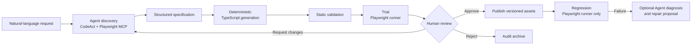

# E2ETestMAF

[日本語](README.ja.md)

E2ETestMAF turns natural-language test requests into reviewed, versioned Playwright tests, then runs approved tests without an LLM in the browser execution path.

> **Project status: Experimental (0.1.0).** APIs and stored asset formats may change before the first stable release.

## Why E2ETestMAF?

AI agents are useful for exploring an unfamiliar web application, but an agent driving a browser on every scheduled run is difficult to review and reproduce. Hand-writing and maintaining every Playwright test is reliable, but expensive.

E2ETestMAF separates those concerns:

- an Agent and Playwright MCP explore the application and diagnose failures;
- a deterministic generator creates TypeScript for `@playwright/test`;
- the standard Playwright runner executes the generated code before approval;
- a human approves the specification, source code, and trial evidence;
- CI runs the approved code without an Agent, LLM, MCP server, or model credentials.

## Key Features

- Generate structured test specifications and Playwright TypeScript from a natural-language objective.
- Validate generated code with the target repository's formatter, linter, TypeScript compiler, and Playwright discovery.
- Capture JSON, JUnit, HTML, screenshots, traces, console errors, and network errors during trial runs.
- Approve scenarios by specification and source SHA-256 hashes.
- Publish approved assets only to `e2e/generated`, `e2e/specs`, and `e2e/metadata`.
- Run active regression tests with the standard Playwright runner and no Agent credentials.
- Classify failures and propose bounded test-maintenance repairs without changing expected results.
- Create a repair branch, commit, push, and pull request; automatic merge is never performed.

## Quick Start

### Prerequisites

- Python 3.13
- [uv](https://docs.astral.sh/uv/)
- Node.js 22 and npm (the CI baseline)
- Chrome or Chromium
- A target repository with `package.json`, local Prettier, TypeScript, and `@playwright/test`, plus either a lint script or local ESLint
- One supported Agent provider for authoring; regression runs do not need one

Install E2ETestMAF from this checkout:

```bash
git clone https://github.com/jimineko/E2ETestMAF.git
cd E2ETestMAF
uv sync --group dev
npm ci
npx playwright install chrome chromium
```

Configure an Agent provider. This minimal example uses the Gemini Developer API:

```bash
export MAF_E2E_MODEL_PROVIDER=gemini
export MAF_E2E_MODEL_AUTH=api_key
export MAF_E2E_GEMINI_API_KEY=YOUR_API_KEY
export MAF_E2E_GEMINI_MODEL=gemini-2.5-flash-lite
```

Create and trial a draft in the target application repository:

```bash
uv run maf-e2e author \
  --target-repo /path/to/web-app \
  --target-url http://localhost:3000 \
  --objective "An unauthenticated user can open the login page" \
  --expected-result "The login heading, email field, and password field are visible"
```

The command writes each generated scenario to `/path/to/web-app/.maf-e2e/drafts/<scenario-id>/`. Review the specification, source, and trial evidence, then approve and publish it:

```bash
uv run maf-e2e review \
  --target-repo /path/to/web-app \
  --scenario-id <scenario-id>

uv run maf-e2e approve \
  --target-repo /path/to/web-app \
  --scenario-id <scenario-id> \
  --reviewer you@example.com

uv run maf-e2e publish \
  --target-repo /path/to/web-app \
  --scenario-id <scenario-id>
```

Run all active scenarios. This command does not load Agent settings or require model credentials:

```bash
uv run maf-e2e regression \
  --target-repo /path/to/web-app \
  --environment staging
```

## How It Works



The approval boundary is deliberate: the TypeScript source that passes the trial is hashed, reviewed, and published. Direct browser actions performed during discovery or diagnosis cannot become an approved regression test by themselves.

## CLI Overview

| Stage | Command | Purpose |
|---|---|---|
| Author | `author` | Explore the application, generate assets, validate them, and run a trial |
| Review | `review` | Print the specification, generated source, metadata, and trial result |
| Review | `approve` | Approve the exact specification and source hashes |
| Review | `request-changes` | Return a scenario for another authoring pass |
| Review | `reject` | Remove the draft and retain an audit copy under `.maf-e2e/rejected` |
| Publish | `publish` | Copy an approved scenario into the target repository's `e2e/**` tree |
| Lifecycle | `disable` / `retire` | Stop selecting an active scenario without deleting audit history |
| Lifecycle | `new-version` | Create a new draft version for changed scenario meaning or expected results |
| Run | `regression` | Execute active scenarios without an Agent |
| Maintain | `analyze-failure` | Classify saved failure evidence, optionally with a new Agent investigation |
| Maintain | `repair` | Validate a bounded code repair and optionally open a GitHub pull request |

See the [CLI reference](docs/cli.md) for options, examples, and exit codes.

## Generated Assets

Drafts stay outside the formal test suite until approval:

```text
.maf-e2e/
  drafts/<scenario-id>/        specification, generated code, metadata, trial evidence
  rejected/                    rejected draft audit records
  regression/<run-id>/         regression reports and Playwright artifacts

e2e/
  generated/<feature>/         approved Playwright TypeScript
  specs/<feature>/             versioned structured specifications
  metadata/<feature>/          active asset metadata and hashes
```

Publishing re-computes both hashes and fails if the approved specification or source has changed.

## Safety Guarantees

- `regression` loads only active metadata and executes fixed Playwright TypeScript.
- `production` is not an accepted target environment; use `local`, `development`, or `staging`.
- Published paths are constrained to the target repository's `e2e` directory.
- Discovery is origin-scoped, file upload is disabled by default, and destructive actions are denied by default.
- Repairs are limited to test maintenance such as locators and Playwright interaction details.
- A changed expected result or scenario meaning requires a new specification version and human approval.
- Repair pull requests are never merged automatically.

Read [Security and execution boundaries](docs/security.md) for CodeAct, Hyperlight, and RAMPART details.

## Requirements and Limitations

The MVP supports Chromium-based tests, TypeScript, GitHub repair pull requests, and Playwright `storageState` authentication. Authoring supports Azure OpenAI, Gemini, Vertex AI, GitHub Copilot CLI, and Codex CLI.

The MVP does not support production targets, visual regression, multiple-browser matrices, a management UI, automatic expected-result changes, or automatic pull-request merge. Hyperlight isolation requires Linux x86_64 and KVM; other local environments can use the audited direct-MCP fallback described in the [configuration guide](docs/configuration.md).

## Documentation

- [Configuration and Agent providers](docs/configuration.md)
- [CLI reference](docs/cli.md)
- [Artifacts and asset lifecycle](docs/artifacts.md)
- [Security and execution boundaries](docs/security.md)
- [Docker, CI, and Azure deployment](docs/deployment.md)
- [Development guide](docs/development.md)
- [Legacy workflow and migration](docs/migration.md)
- [Product requirements](docs/E2ETestMAF_requirements.md) (Japanese)
- [Implementation status](docs/E2ETestMAF_implementation_status.md) (Japanese)

## Contributing

See [CONTRIBUTING.md](CONTRIBUTING.md). The standard local checks are:

```bash
uv run ruff check .
uv run mypy
uv run pytest
```

Security reports should follow [SECURITY.md](SECURITY.md).

## License

This repository does not currently include a license. Until a license is added, no open-source license is granted for use, modification, or redistribution.
